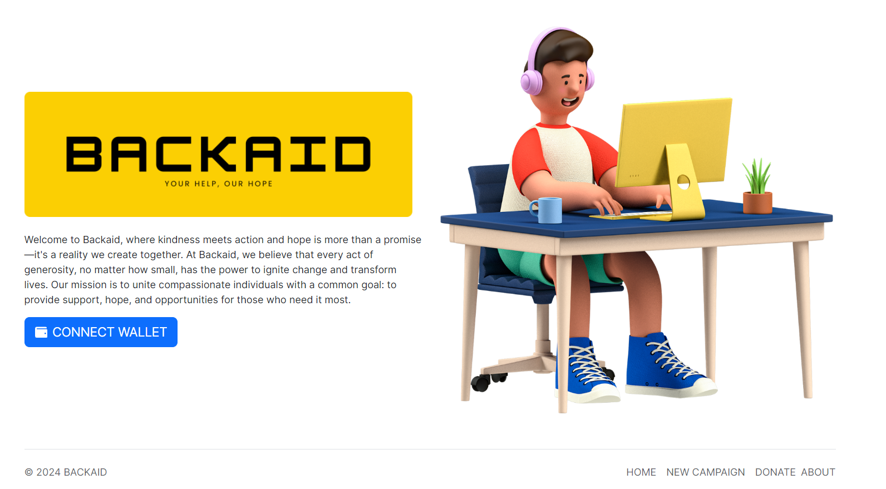
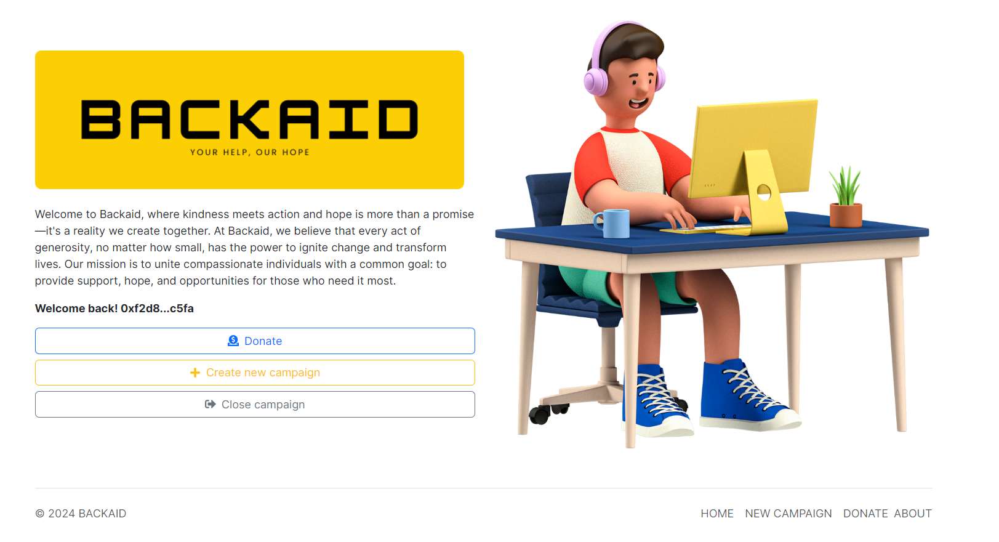
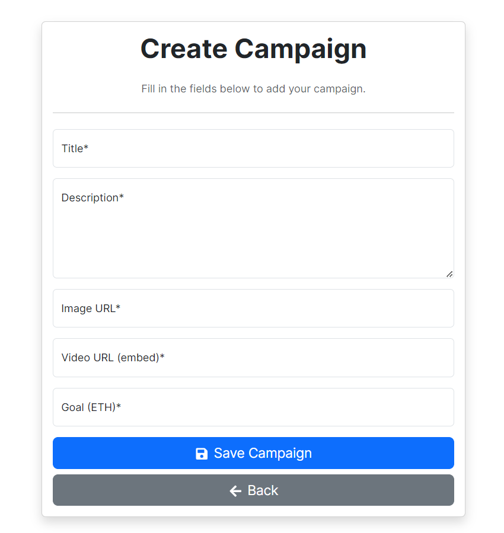
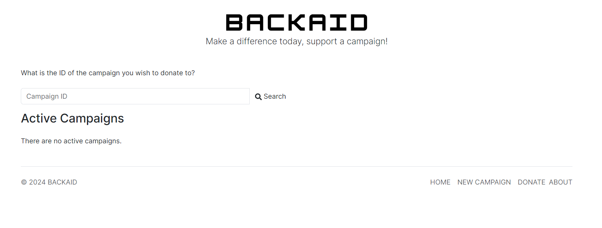
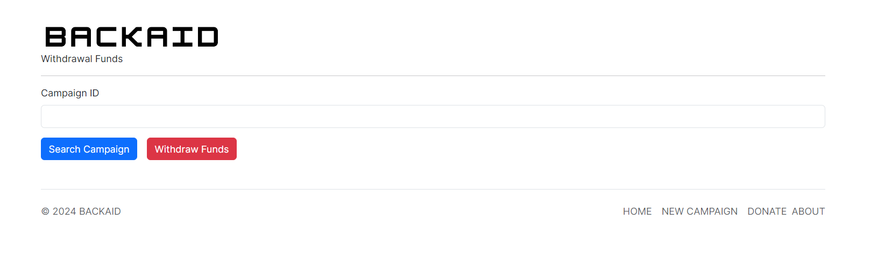

## Introduction

###  The Story Behind Backaid
The idea for Backaid emerged from observing the struggles faced by individuals and communities worldwide. Whether it's families grappling with unexpected crises, animals in need of rescue, or communities striving to rebuild after disasters, the common thread is a need for timely, effective assistance. Traditional avenues of support often fall short, leaving gaps that compassionate individuals want to fill but don’t always know how.

### A Platform for Everyone
Backaid was designed with the belief that everyone, regardless of their situation, deserves a chance to receive help and the opportunity to live with dignity and hope. We envisioned a platform that is not just a fundraising tool but a beacon of hope where people can come together, share their stories, and rally support from around the globe.

### Empowering Individuals to Make a Difference
We believe that generosity should not be constrained by geographic boundaries or bureaucratic hurdles. Backaid allows anyone with a cause, no matter how big or small, to create a campaign and connect with a community eager to help. Our mission is to empower individuals to make a tangible difference in the lives of others, fostering a sense of global responsibility and shared humanity.

## How To

### Create a campaign

First, go to the home page and than connect your wallet.

Select the option to Create new campaign.

Insert all the information about your cause and then confirm in your wallet. Now share your campaign ID with your friends. 
You can only create one campaign at a time.

REMINDER: video url must be embed.

### Donate
Search by your prefered campaign ID or choose one from the active campaign list.

### Close campaign

Search by the campaign ID that you created and then withdraw funds.

### WARNING
Backaid smart contract was originally deployed on Base Testnet, so be very carefully while using the dapp. Also, remenber that we are still testing things.

